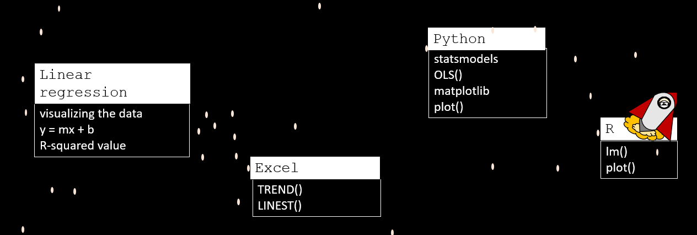
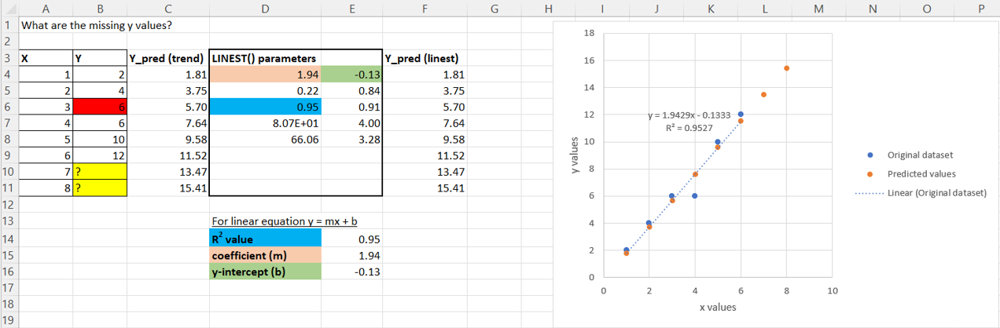

# LinearRegression_Excel

[Hello, World!](https://www.youtube.com/watch?v=MrEkwt-wZ5w) I am the DataByte. This repo hosts my Excel files that I walk through in my linear regression series on YouTube. 

Check out my video [Linear Regression with Excel, Python & R](https://www.youtube.com/watch?v=yWoRWu5FUZQ) to hear more about these topics:

# Mathematics

In my YouTube video, I give a short mathematical explanation of how linear regression trendlines are calculated with the least squares method. 

## R2 value 

The r2 value (the coefficient of determination) helps you determine if your data is exhibiting linear behavior or not. R2 values range between 0 and 1, with 1 indicating a perfect linear trend. Values beteween 0.7 and 1 indicate that your data has a linear trend, the closer to 1, the better. You probably don't want to be using any linear trendlines with r2 values less than 0.7 to make predictions. 

# Code

There are ways to code in Excel with VBA but it's not needed here. Simply the `TREND()` or `LINEST()` functions are needed in Excel to fit a linear trendline.   

 

# Dependencies

None

# References

It is easy to find sources online to learn more about linear regression, here are some great references to what I used. 

## Excel:

[TREND Function](https://support.microsoft.com/en-gb/office/trend-function-e2f135f0-8827-4096-9873-9a7cf7b51ef1)

[LINEST Function](https://support.microsoft.com/en-us/office/linest-function-84d7d0d9-6e50-4101-977a-fa7abf772b6d)

## Mathematical background: 

Miller, I., Freund, J. E., & Johnson, R. A. (2005). Miller and Freund's Probability and statistics for engineers. Upper Saddle River, NJ: Prentice Hall.

[Sigma summation](http://www.columbia.edu/itc/sipa/math/summation.html)

# More?

If you want to hear more from me, check out my [Hello, World!](https://www.youtube.com/watch?v=MrEkwt-wZ5w) video on YouTube and subscribe! I'm constantly working on new content :) 
